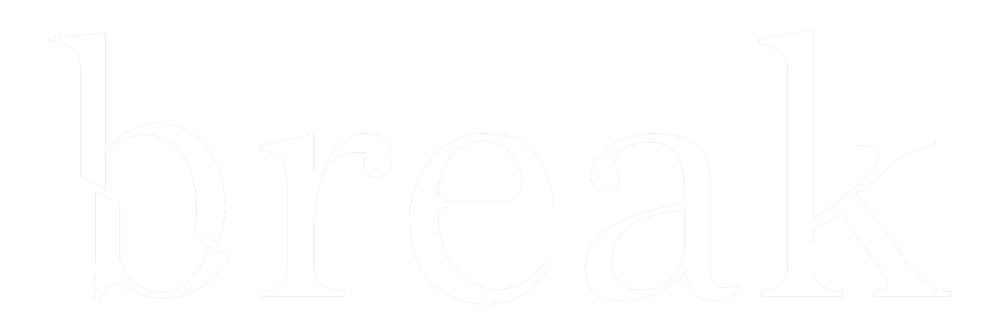

# Break Ministry Website™

"By using modern advances in technology, an innovative approach to ministry, and the teachings of the Catholic Church, Break will support parishes, dioceses and all Catholic organizations in the mission of leading young people to a life changing encounter with Christ."

New Things to add:
- Add Break Promo Video https://youtu.be/OZx70Qq16mU
- Donate button (Could link to Venmo?)
- Create Contact Us and Apply Forms using Zoho Forms

Website Checklist/Features list:
- Functionality:
    - [x] Dark Mode toggle?
        - [x] Change Menu Text/Logo
        - [x] Make True Black
    - [x] Make Tech Covenant
    - [ ] Map for Check in?
    - [x] Something "Breaks" on the page Easter Egg? (Break Logo)
    - [ ] Use Flask? (Dependent on other longer term features)
        - [x] Look in to Flask functionality
    - [x] Making hover/popup for About Page

- Sections for Navbar/Main Page
    - [x] About (refer to Restructure Document) (done)
    - [x] Services (refer to Restructure Document)
        - Reference to Recurring Events based on Service
        - Or link to said event that we have done in the past
    - [x] Events
        - [x] Recurring Events (Check Google Calender)
        - [x] Flocknote Signup (grab from Break Events Info Group)
    - [x] Apply (Opens to Google Form page)
    - [x] Contact Us Page?
    - [x] Media Page? (Old Photos, Videos, etc.)
    - [x] Testimonials
        - [x] Reach out for Testimonials

- Other Pages:
    - [x] 404 Page (with pun about Break)

Long Term Features:
- [ ] Implement Flask into Website 
- [x] Transfer Website to website hosting service
- [ ] Login for Admins and Break Members
    - [ ] Create/RSVP for events via website
    - [ ] See Upcoming Events
- [ ] Instagram Feed via API?
- [ ] Break Database
- [ ] Break Book Club
- [ ] Create Form for Apply that doesn't rely on Google Forms

Action Items:
- Carmela
    - [x] Create graphics for Home Page (N)
    - [x] Talk with Rudy about Apply Page Photo(s) for top of page (N)
    - [ ] Learn some HTML, CSS stuff
- Ruan
    - [x] Create 404 Page
    - [x] Move About Us Page
    - [x] Make hover/popup for About Us Page Leadership Photos
    - [ ] Continue working on bio popup on click for About Us Page Leadership
        - Needs to be looked into a little more for dependency
    - [x] Create Popup template for Covid19 stuff when opening home page/website first time (N)

- Kipsy
    - [x] Reach out for Testimonials
    - [x] Fix 404 page (N)
        - [x] Add a thing that tells the user to share it with Break on Facebook or Instagram for shoutout
    - [x] Talk to Ramil/Mike about Mission Statement
    - [ ] Help with Contact Us Section or Media Page

- Jeff
    - [x] Set Up Media Page
    - [x] Implement Dark Mode
        - [x] Menu/Logo Change
        - [x] Make True Black
    - [x] Finish up Media page (N)
    - [x] Add Contact Us Section (N)

- Rudy
    - [x] Ask Carmela about graphics for home page
    - [x] Put Photos into Google Drive Folder for Media Page
    - [x] Covid-19 Blurb (N)
    - [x] Testimonials on Pictures (N)
    - [x] Send Photoshopped Covid Picture (N)
    - [x] Find out about Break Ministry Title (Inc? LLC?)
    - [x] Talk with Carmela about Apply Page Photo(s) for top of page (N)

    N = Necessary
