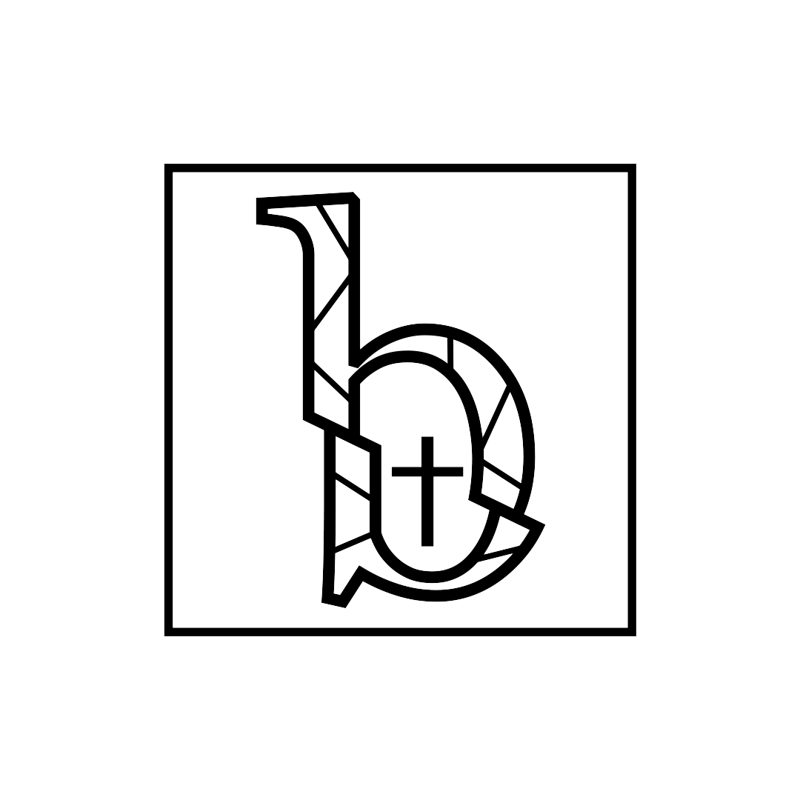

# Break Ministry Website™

"By using modern advances in technology, an innovative approach to ministry, and the teachings of the Catholic Church, Break will support parishes, dioceses and all Catholic organizations in the mission of leading young people to a life changing encounter with Christ."

Website Checklist/Features list:
- Functionality:
    - [ ] Dark Mode toggle?
    - [ ] Map for Check in?
    - [ ] Something "Breaks" on the page Easter Egg? (Break Logo)
    - [ ] Use Flask? (Dependent on other longer term features)

- Sections for Navbar/Main Page
    - [x] About (refer to Restructure Document)
    - [x] Services (refer to Restructure Document)
        - Reference to Recurring Events based on Service
        - Or link to said event that we have done in the past
    - [x] Events
        - [x] Recurring Events (Check Google Calender)
        - [x] Flocknote Signup (grab from Break Events Info Group)
    - [ ] Apply (Opens to Google Form page)
    - [x] Contact Us Page?
    - [ ] Media Page? (Old Photos, Videos, etc.)
    - [x] Testimonials
    
- Design Checklist
    - [ ] Minimal
        - [ ] How minimal do we want to be?
    - [ ] Easy to Navigate
    - [ ] Has functionality in place for short and long term needs
    - [ ]

- Other Pages:
    - [ ] 404 Page
        - [ ] Break Puns Galore

Long Term Features:
- [ ] Login for Admins and Break Members
    - [ ] Create/RSVP for events via website
    - [ ] See Upcoming Events
- [ ] Break Database
- [ ] Break Book Club